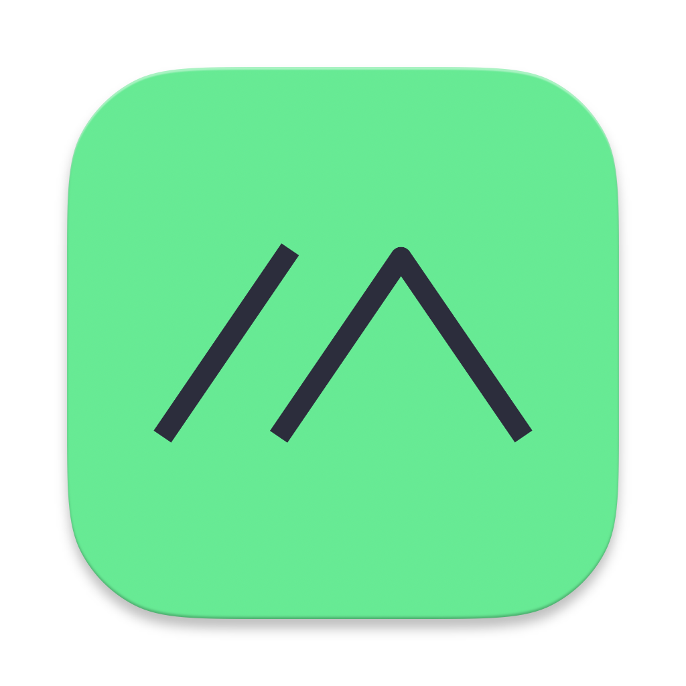

<div align="center" markdown="1">



  <h1 align="center"> Indicator RP2040 Companion Firmware
</h1>
  <p style="font-size:15px;" align="center">This is a modified companion firmware based on <a href="https://github.com/Seeed-Solution/SenseCAP_Indicator_RP2040">SenseCAP_Indicator_RP2040</a> </p>


[](https://cla-assistant.io/meshtastic/indicator_rp2040)
[](https://opencollective.com/meshtastic/)

</div>

## Features
- Finer sensor control
- Passes values from a NMEA-connected GPS module to the uplink CPU
- Future development: Adding SDCard support

## Installation
Since we are not currently providing pre-built `.uf2` binaries, you will need to build the firmware using PlatformIO.

### Steps:
1. Install [PlatformIO](https://platformio.org/install).
2. Clone this repository.
3. Open a terminal and navigate to the repository directory.
4. Build the firmware using the following command:
   ```sh
   pio run -e seeed_indicator_rp2040
   ```
5. Once compiled, flash the firmware to the RP2040 using one of the following methods:
   - Use PlatformIO's "Upload" command to flash the firmware directly, ensuring you select the RP2040's serial port.
   - Navigate to the build directory, locate the compiled `.uf2` file, and drag and drop it onto the RP2040 USB drive while in **BOOTSEL** mode.
     - Please see [Seeed's wiki](https://wiki.seeedstudio.com/SenseCAP_Indicator_How_To_Flash_The_Default_Firmware/#flash-the-uf2-file) for instructions on placing the device in **BOOTSEL** mode.

## License
This project is licensed under the **GNU General Public License v3.0 (GPL-3.0)**. See the `LICENSE` file for details.

## Stats


